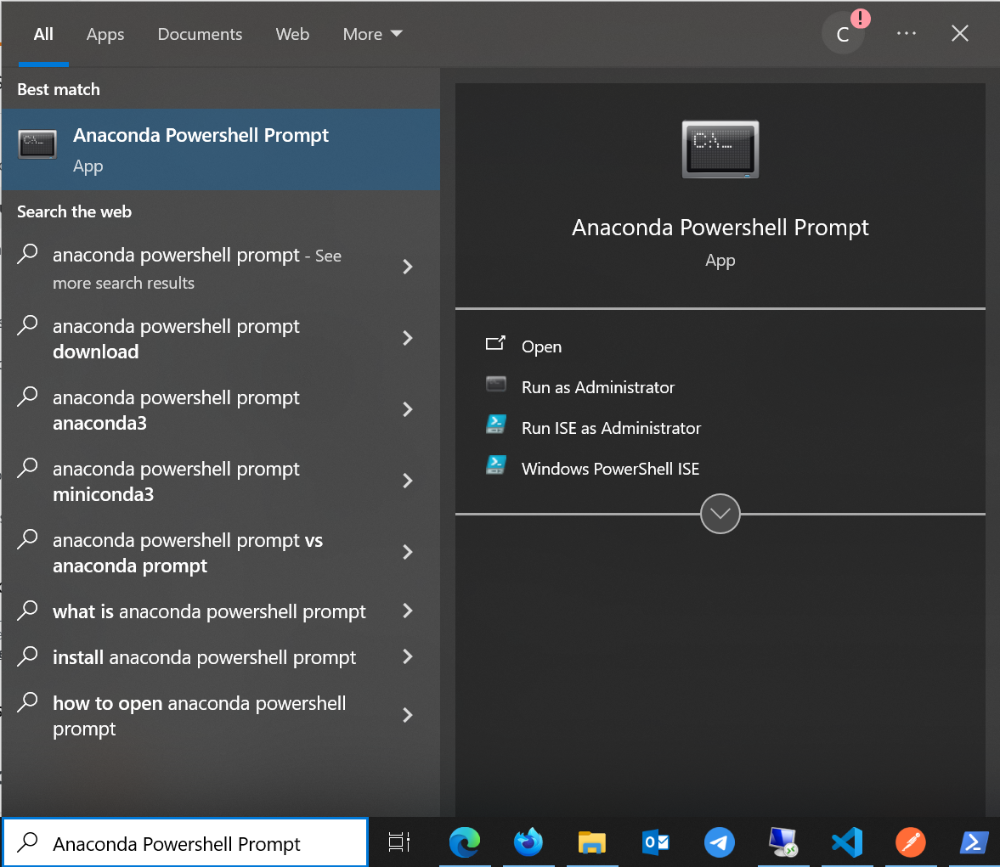
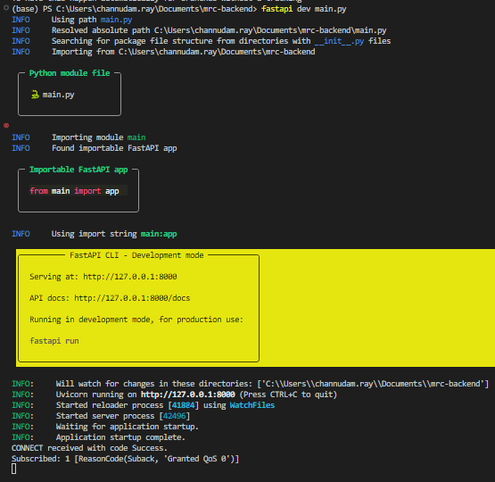

# flashflood-backend

## Getting started

This API application is built in fastApi which is a framework in Python. Before starting to run this application, make sure you have virtual environment installed in your local machine. Please follow the steps below.

### Install virtual environment

1. Please [click here](https://repo.anaconda.com/miniconda/Miniconda3-latest-Windows-x86_64.exe) to download. Once the download is completed, please start to install and follow the process until finish the installation. 
2. Next, after completing the installtion, try to run `conda --version` command in Windows Powershell prompt. If you get the result like below it means you are fine! But if not please continue to number 3.

3. Please run `powershell -ExecutionPolicy ByPass -NoExit -Command "& 'C:\miniconda3\4.9.2\shell\condabin\conda-hook.ps1' ; conda activate 'C:\miniconda3\4.9.2' "` command in your Windows Prowershell prompt.
4. Open <b>Anaconda PowerShell Prompt </b> from Start Menu.

5. Try to run `conda init powershell` command in Anaconda PowerShell Prompt.
6. Fianlly, try number 2 again!

### Create and activate a virtual environment

1. Move to your woring directory where the application is located.
2. Open Windows Powershell in that working directory and run `conda create -p env python=3.10 -y` command.
3. Activate the environment that created earlier by running `conda activate ./env` command (make sure your are in the location where env directory is located).

### Install the requirements

After actvate a virtual environment please continue to run `pip install -r requirements.txt` command

### Start Application

To start a application, just simplify run `fastapi dev main.py`. The terminal output should be similar to the image below.

